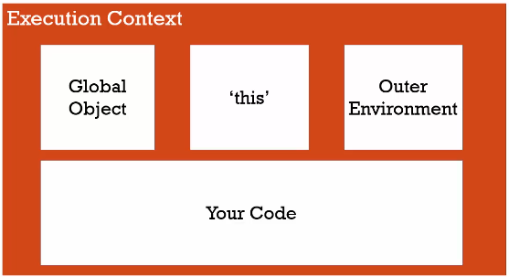

# Intorduction to Conceptual JS

Deep dive into JS

## Syntactic Parsers

- It's a program that reads your code and determines what it does and if it's grammer is valid. It convert your program into something that the computer can understand (compliers, interperters).

---

## Lecical Environments

- Where something sits physically in the code you write. It will determine how the JS engine will decide where variables and code will sit in memory and how they will connect to each other.

---

## Execution Contexts

- A _wrapper_ to help manage the code that is running, there are lots of lecical enviroments, which one is currently running is managed via Execution Context. It can contain things beyond what you've written in your code.

  - **Types**

    1. **Global Exection Context:** the word global means Code/variabls that isn't inside a function. Global Exection Context which is created by the JS engine (running in chrome, for example) created 3 things:

       - Create global object
       - The "this" Object
       - Outer Environmnet

**_Note:_** When Objects and functions aren't sitting inside a function it get attached to the global variabls.

### The Exection Context is Created in two Phases

1. **Creation Phase**: in this phase as the **Parsers** runs through the code and begins to setup what is written for translation, it recognises where variables and functions are created and sets up the memory accordingly, varibales are created and placed into memory in the creation phase (known as Hoisting), so these functions and varibales do exist in memory and can be accessed, however, when it sets a variable's value it puts a placeholder called "undefined". All objects in Javascript is set to undefined while declaring [Example](Hoisting.md).

2. **Execution Phase**: in this phase, the JS engine runs the code line by line. Interperting it, converting it, compling it and then executing it.

There is always a global object (insides a browser its the window Object). Without writting any code we have these variables avalablle to us.

At a global level "this" = Global Object.

---

## What's an Objects

It is Simply, a colletion of of name value pairs, where values can also be a name value pair

    let object = {
            Name: "Ahmad",
            Address: "Cairo Egypt",
            Age: 21
    }

---

## Single Threaded vs Synchronous vs Asynchronous

Js is single threaded and Synchronous in it's execution.

**Single Threaded:** This means that one command is run at a time.

**Synchronous:** One line of code being executed at a time and in order.

**Asynchronous:** More than one at a time.

---

## Function Execution and Invocation Stack

**Invocation:** running/calling a function.

**Invocation Stack**
Let's step through what will happen when some js code is run, what's going to be created ?

The parser will parse the code and then the _compiler program_ is going to interpret your code and the global execution context will be created

1. Create the variable **"this"**.
2. Create a global object (window in the browser).
3. It will attach global functions and variables into it.
4. It will set up the memory space for them in the creation phase of the execution context.
5. The code will be executed line by line in the execution phase.

When a function is invoked (even if it's invoking itself), a new execution _context is created_, and placed on the **_execution stack_**, with the context on the top of the stack being the one that is currently running.

When a new execution context is created it does just like the global execution function:

1. Creation phase:

   - The "this" function is created.
   - the variables are setup, it will have own space for variables and functions.

2. Execition phase: it will execute the code until another function invocation. It will stop at that line of code and create another execution context, which is inserted in the Invocation Stack and then that code is run.

3. When the function at the top of the _Invocation Stack_ finishes, it will get popped off the stack and now the new top context continue from where it left off.

**_Note:_** the creation of the execution context doesn't depend where the function it physically written but where it is call/invoked.

---

## Varibale Environment (Scope)

Where the variable lives (where is the varibale) and how the relate to each other in memory.

    "Every execution context will have it's own Varibale Environment with it's own values."

So eventhough myVar is declared 3 times, they are distincted they're unqiue and they don't touch eachother, they will each exist in a different execution context.

---

## Scope Chain

**Scope:** Where can I access a varibale.
**Chain:** links of outer environments refrences.

When a function is invoked, the new context is created and the outer refreance is set according to it's physical location in the code.

When we are trying to access a varibale that isn't defined in the same context, it looks for the same varibale in the context's outer environments refrences (which is set according to it's physical location in the code).

### Example A

    function b() {
        console.log(myVar);
    }

    function a() {
        var myVar = 2;
        b();
    }
    var myVar = 1;
    a();

In this example, both functions a and b have external refrences to the global context since they both were defined globally. So when tring to access "myVar" b will look firstly into it's local context to try and find "myVar" then it will move down the _Scope Chain_ (Which is the gobal Context enviroment) and look for the value of "myVar".

### Example B

    function a() {
        function b() {
           console.log(myVar);
        }
        var myVar = 2;
        b();
    }
    var myVar = 1;
    a();

In this example, function b() has external refrence to the function a()'s context, which has external refrences to the global context. So when tring to access "myVar" it will look firstly into it's own local context to try and find "myVar" then it will move down the _Scope Chain_ ,which is the a()'s context, then look for the value of "myVar".

    Where some code sites determine's it's outer enviroments refreance

---

## Block Scoping (let)

As in most other programing langugues, a variable is only visiable in the block it is defined in, it can't be accessed outside that block.

---

## Event queue

Full of notification events what we want to be notified of, we can listen for an event and preform a function accordingly.

---

## Asynchronous Callbacks

JavaScript as mentioned above is synchronous it doesn't execute asynchronously, it executes code a line at a time. So how does it handle asynchronous events.

JavaScript engine itself we understand that it doesn't exist by itself inside (for example an Internet browser) there are _other elements/engines_ running other pieces of code which is happening outside the JavaScript engine
for example:

- rendering engine: that actually renders or paints to the screen whatever the web pages that you're looking at
- Other elements of the browser handles getting HTTP requests and responses

**How does JavaScript engine communicate with other engines/ elements ?**
JavaScript engine has _hooks_ where it can talk to the engines (rendering engine for example) and change what the web page looks like meaning that the rendering engine, the JavaScript engine and the request are running asynchronously inside the browser but however what happens inside just the JavaScript engine is **exclusively synchronous**.

---

## Event Queue

When functions are being called new contexts are being created and stacked on top of each other in the **Invocation Stack** and as they finish they leave the stack. However, there is another list that's inside the JavaScript called the event queue and this is full of event _notifications_ of events that might be happening somewhere outside the JavaScript engine that we want to be notideied of it gets placed on **Event Queue** where functions can listen for this specific event and be invoketed.

    The event queue get looked at by the JS engine when the execution/invocation stack is empty.

The browser is asynchronous placing events in the event queue, but the code running is still running line by line and when execution stack is empty, then processes the events.

---

## Types (Dynamic Typing vs Static Typing vd Primitive Type)

**Dynamic Typing**: The type of data isn't specified while declaring, the engine figuers it out while the code is running. This also means variables can hold different types of values.

**Dynamic Typing**: The type of data must be specified while declaring. [bool, string, integer]

**Primitive Simple Type/:** a type that represent a _single value_, unlike an **object** which is a _collection_ of name value pairs.

There are 6 type:

1. Undefined
2. Null
3. Boolean
4. Number: can have some decial
5. String
6. Symbol

---

## Operatores & Precedance (+ - / > < \* )

All Operatores are infix function calls.

Operation precedance: which function/operatores will be called first. 

---

## Coercion (Casting)

    var a = 1 + '2';
    console.log(a);

In this example, the output will "12" the number 1 will be converted to a string.

    console.log(1 > 2 > 3);  // output true
    console.log(3 > 2 > 1);  // output also true (false > 1)

**_NOTE:_** "===" operator is the strict version of "==", similarly "!=" and "!==".

---

## Existance

Is a variable actually set ? We can check this by **Operatores** and **Coercion**.

| Operation          | Value after coersion |
| ------------------ | -------------------- |
| Boolean(undefined) | False                |
| Boolean(null)      | False                |
| Boolean("")        | False                |
